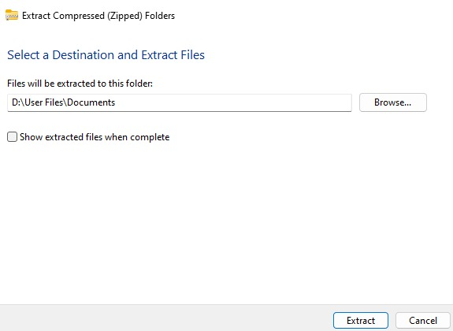
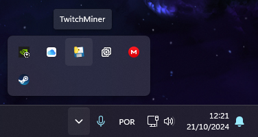

# TwitchMiner Bot

TwitchMiner é um bot que automatiza a mineração de pontos em transmissões ao vivo na plataforma Twitch. Ele executa em segundo plano no sistema Windows e inicia automaticamente junto com o computador.

## Funcionalidades

- Mineração automática de pontos em transmissões ao vivo no Twitch.
- Execução discreta em segundo plano.
- Configuração fácil e rápida.
- Inicia automaticamente com o sistema operacional.

## Requisitos

- Windows 10 ou superior.
- Roda em qualquer torradeira.
- Conta registrada na Twitch.

## Instalação

Siga os passos abaixo para configurar o TwitchMiner no seu PC:

1. **Download do Arquivo**
   - Faça o download do arquivo `TwitchMiner.zip` e extraia-o para a pasta `Documentos` (Sim, tem que ser nessa pasta, caso contrário a inicialização automática não irá funcionar).

   

2. **Extração**
   - Extraia o conteúdo do arquivo zipado. Dentro da pasta extraída, haverá apenas um arquivo principal para rodar o bot.

3. **Execução**
   - Abra o arquivo extraído e siga os passos de configuração que aparecerão na tela.

4. **Configuração Automática**
   - Após configurar o bot, reinicie o computador.

5. **Execução em Segundo Plano**
   - O bot iniciará automaticamente junto com o sistema e minerará pontos em segundo plano.

## Como funciona

O bot é configurado para monitorar as transmissões ao vivo dos canais que você segue e minerar pontos automaticamente. Ele roda silenciosamente em segundo plano e você pode verificá-lo a qualquer momento.

   

## Aviso Legal

Este projeto foi criado apenas para fins educacionais. O uso deste bot em sua conta da Twitch pode violar os Termos de Serviço da plataforma. Use por sua conta e risco :D.
